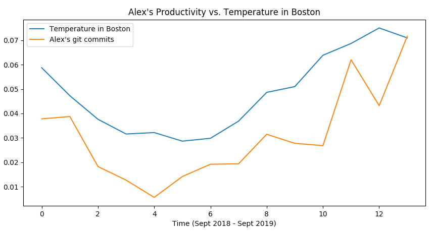

# SAD Diagnostics

A collection of scripts to fetch git commit counts and temperature data, then compare them over the course of a year.



## Requirements

 - Python 3
 - A Weatherstack API Key
 - A Github personal OAuth token

## Setting Up

You'll need to set the following environment variables in a .env file:
```
WEATHERSTACK_KEY=<Key>
GITHUB_KEY=<Personal token>
GITHUB_USERNAME=<Your username>
LOCATION=<city name (i.e. Boston)>
```
Then run...
```
$ virtualenv venv
$ source venv/bin/activate
$ pip install -r requirements.txt
```


## Using it

#### Fetch Github commit data

`$ python commits.py`

#### Fetch weather data

`$ python weather.py`

#### Display resulting data

`$ python display.py`
